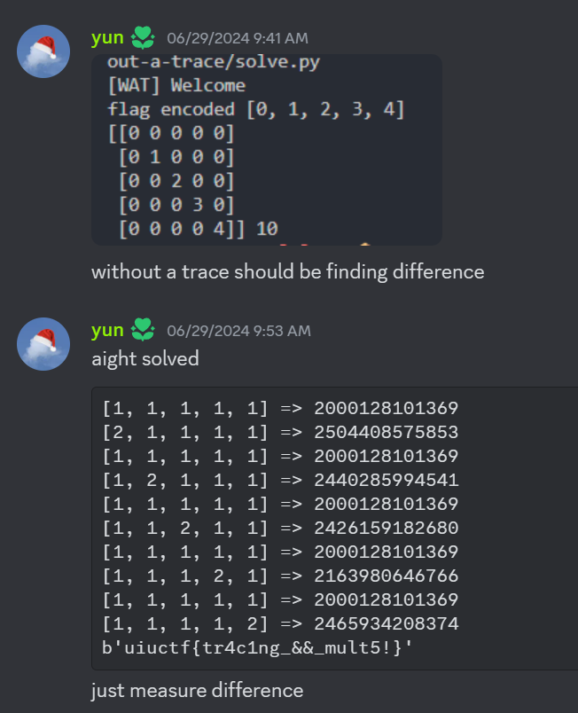

## Without a Trace (298 Solves, 246 Pts)
```
Author: Anakin

Gone with the wind, can you find my flag?

ncat --ssl without-a-trace.chal.uiuc.tf 1337
```

I didn't solve this challenge during the ctf, but it was solved by my teammate Yun. This writeup consists of my own analysis and solve for the challenge after the ctf, after having referenced Yun's solve.

`server.py`
```py
import numpy as np
from Crypto.Util.number import bytes_to_long
from itertools import permutations
from SECRET import FLAG


def inputs():
    print("[WAT] Define diag(u1, u2, u3. u4, u5)")
    M = [
        [0, 0, 0, 0, 0],
        [0, 0, 0, 0, 0],
        [0, 0, 0, 0, 0],
        [0, 0, 0, 0, 0],
        [0, 0, 0, 0, 0],
    ]
    for i in range(5):
        try:
            M[i][i] = int(input(f"[WAT] u{i + 1} = "))
        except:
            return None
    return M

def handler(signum, frame):
    raise Exception("[WAT] You're trying too hard, try something simpler")

def check(M):
    def sign(sigma):
        l = 0
        for i in range(5):
            for j in range(i + 1, 5):
                if sigma[i] > sigma[j]:
                    l += 1
        return (-1)**l

    res = 0
    for sigma in permutations([0,1,2,3,4]):
        curr = 1
        for i in range(5):
            curr *= M[sigma[i]][i]
        res += sign(sigma) * curr
    return res

def fun(M):
    f = [bytes_to_long(bytes(FLAG[5*i:5*(i+1)], 'utf-8')) for i in range(5)]
    F = [
        [0, 0, 0, 0, 0],
        [0, 0, 0, 0, 0],
        [0, 0, 0, 0, 0],
        [0, 0, 0, 0, 0],
        [0, 0, 0, 0, 0],
    ]
    for i in range(5):
        F[i][i] = f[i]

    try:
        R = np.matmul(F, M)
        return np.trace(R)

    except:
        print("[WAT] You're trying too hard, try something simpler")
        return None

def main():
    print("[WAT] Welcome")
    M = inputs()
    if M is None:
        print("[WAT] You tried something weird...")
        return
    elif check(M) == 0:
        print("[WAT] It's not going to be that easy...")
        return

    res = fun(M)
    if res == None:
        print("[WAT] You tried something weird...")
        return
    print(f"[WAT] Have fun: {res}")

if __name__ == "__main__":
    main()
```

`main()` calls `inputs()` which lets us input our own 5-by-5 diagonal matrix `M`. This `M` is piped into `check()`, then `fun()` is called which encrypts the flag.

`check()` was a bit confusing, when I'd looked into it. But playing around with it as a blackbox seems to indicate that it seems to allow any valid `M` whose diagonal entires are all non-zeroes through.

```
Future Warriii:
So while taking a look at and in writing my writeup for Determined I've noticed that `check()` here is pretty much the exact same as `fun()` in Determined, which is heavily implied to be computing the determinant of the matrix. 

This does explain why check() would only allow non-zero diagonal entry M through.

The determinant of a matrix is zero if and only if there exists a full [row/column] that is all 0s, or there exist a [row/column] that can be expressed as a linear sum of the remaining [rows/columns]. (the all-0s condition can be derived from the second, but I'm writing them separately so it would hopefully make sense when considering a diagonal matrix)

Observe that the latter case will never happen for a diagonal matrix. 

Thus, For a diagonal matrix, the only way in which its determinant would be zero must be when one of its entries is 0! Anything else gives a non-zero determinant which passes the check() test in main()
```

`fun()` takes in the secret `FLAG` variable, and splits the flag into 5 unknown values. It then creates its own diagonal matrix, performs matrix multiplication with our own diagonal `M`, and outputs the trace of the result.

It is trivial to observe that if we split the `FLAG` variable into unknowns `f1, f2, f3, f4, f5`, and our `M` diagonal entries as `m1, m2, m3, m4, m5`, the matrix multiplication simply returns a diagonal matrix with diagonal entries `f1 * m1 , f2 * m2 , f3 * m3 , f4 * m4 , f5 * m5`.

The trace of a matrix, in our case a 2D one, would be the sum of its diagonal entries, thus we would get:

`f1 * m1 + f2 * m2 + f3 * m3 + f4 * m4 + f5 * m5`

Yun's solution involved making 5 connections to the server with 5 distinct `M` inputs, thereby generating a list of 5 unique linear equations with the same unknowns. One can then solve the linear system to recover the 5 unknowns and thus, reconstruct the flag.



I've managed to improve on this and find a way to obtain the flag from just a single connection to the server! Observe that since `f1, f2, f3, f4, f5` are all 5-bytes, each of them must be less than `2^40` numerically (since 1 byte is 8 bits).

Thus, if we just enter `(1, 2**40, 2**80, 2**120, 2**160)` as our `M`, we just need to convert the trace output into bytes to recover our `f1, f2, f3, f4, f5` values and thus the flag! (I'll leave it to the reader to figure out why)

We connect to the server and obtain the following:
```
ncat --ssl without-a-trace.chal.uiuc.tf 1337
[WAT] Welcome
[WAT] Define diag(u1, u2, u3. u4, u5)
[WAT] u1 = 1
[WAT] u2 = 1099511627776
[WAT] u3 = 1208925819614629174706176
[WAT] u4 = 1329227995784915872903807060280344576
[WAT] u5 = 1461501637330902918203684832716283019655932542976
[WAT] Have fun: 680776388066759064700575205866223405679633882631922966160244
```

We convert this into bytes using python,
```py
>>> (680776388066759064700575205866223405679633882631922966160244).to_bytes(25, "big")
b'lt5!}&&_muc1ng_f{tr4uiuct'
# lt5!}
# &&_mu
# c1ng_
# f{tr4
# uiuct
```

Thus reconstructing our flag,
`uiuctf{tr4c1ng_&&_mult5!}`